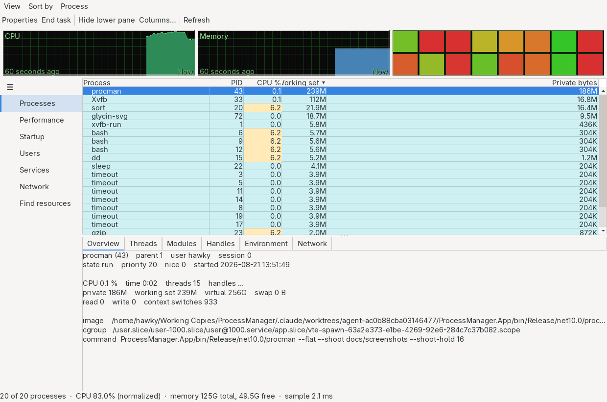
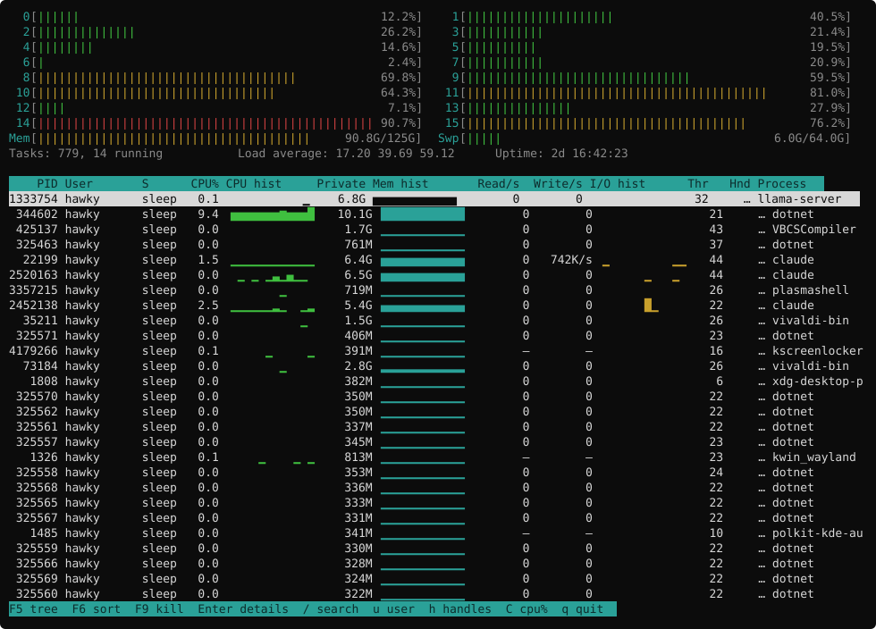

# ProcessManager

[](LICENSE)
[](https://github.com/Hawkynt/ProcessManager)

[](https://github.com/Hawkynt/ProcessManager/actions/workflows/ci.yml)
[](https://github.com/Hawkynt/ProcessManager/commits/main)
[](https://github.com/Hawkynt/ProcessManager/pulse)

[](https://github.com/Hawkynt/ProcessManager/stargazers)
[](https://github.com/Hawkynt/ProcessManager/network/members)
[](https://github.com/Hawkynt/ProcessManager/issues)
[](https://github.com/Hawkynt/ProcessManager)
[](https://github.com/Hawkynt/ProcessManager)

[](https://github.com/Hawkynt/ProcessManager/releases/latest)
[](https://github.com/Hawkynt/ProcessManager/releases)
[](https://github.com/Hawkynt/ProcessManager/releases)

> A cross-platform process manager in C#: a Process-Explorer-shaped desktop UI and an htop-shaped
> terminal UI over one sampling engine. The desktop UI is built on
> [NativeForms](https://github.com/Hawkynt/NativeForms), so the same binary puts real Win32 windows on
> Windows and real GTK windows on Linux without a second UI codebase.

> [!IMPORTANT]
> **Working, with the gaps written down.** Linux is complete: engine, probe, both front-ends, the six
> detail views, and the privileged helper. Windows is complete bar the environment block, and has
> been executed and checked against a kernel **under Wine** — 21 of 21 self-test checks, 47 modules,
> 95 handles — but not yet on a genuine Windows machine. macOS throws by design. Three desktop
> features (row colours, click-to-sort, in-cell sparklines) are blocked on one missing hook in the UI
> toolkit. [`docs/PRD.md`](docs/PRD.md) tracks all of it box by box; §12 is the per-feature coverage
> matrix and §10 the milestone state.

## 📸 What it looks like

[](docs/screenshots/desktop.png)

Rows are coloured by what kind of process they are, and three of the columns are drawn rather than
written — CPU, memory and I/O history, one pixel per sample, sharing one scale so the rows can be
compared with each other. The plots read as instruments rather than as part of the desktop: black
ground, green graticule, filled area.

[](docs/screenshots/tui.svg)

The same three histories in the terminal, drawn with the eighth-block characters
(`▁▂▃▄▅▆▇█`) — and an ASCII ramp on a terminal whose locale is not UTF-8, because a column of
replacement boxes is worse than no plot at all.

Both are regenerated by [`tools/shoot-screenshots.sh`](tools/shoot-screenshots.sh), which gives the
machine some real work first so the plots have a shape. The window is photographed from inside the
process — a runner has no compositor to grab pixels from — and the terminal is written as SVG, which
needs no font, weighs nothing, and shows *which line* changed in a pull request.

## ✨ What it is

Three things that are usually three separate programs:

- **A process explorer** — the process tree with per-process CPU, memory, I/O, handles and threads;
  the detail views (threads, modules, open handles, environment, network endpoints); and the search
  that answers "which process has this file open?".
- **A task manager** — end a process or its tree, suspend and resume it, change priority and CPU
  affinity, and see at a glance what is eating the machine.
- **A terminal monitor** — the same data as a full-screen console UI over SSH, where no display exists
  and installing a desktop toolkit is not an option.

All three read from **one** sampling engine (`ProcessManager.Core`) behind one platform probe
interface. A metric is implemented once, and both front-ends get it; a front-end has no privilege to
read anything the other cannot.

## 🧩 Architecture

```
ProcessManager.Core                Sampling engine: snapshots, deltas, rates, history, tree building,
                                   sort/filter. No platform code, no UI, no I/O beyond the probe.
ProcessManager.Platform.Linux      /proc, /sys, cgroup v2, netlink                       — shipping
ProcessManager.Platform.Windows    NtQuerySystemInformation, ToolHelp32, PDH             — shipping
ProcessManager.Platform.MacOS      libproc / sysctl                                      — stub, throws
ProcessManager.Ui.Terminal         Terminal renderer, no toolkit dependency
ProcessManager.Ui.Desktop          Desktop UI on NativeForms
ProcessManager.App                 The one binary: CLI plus both front-ends           — procman
ProcessManager.Elevated            procman-helper: the only component that ever runs as root/admin
```

One executable carries both front-ends, so `procman` and `procman --tui` are the same program. A
headless machine still never loads GTK: a NativeForms backend that is not registered is never asked
for its native library.

Core never calls a native API; it asks an `ISystemProbe` for a `SystemSnapshot` and does the
arithmetic. That is what makes the whole engine testable against recorded `/proc` trees and captured
Windows structures rather than against the machine running the tests — see
[PRD §9](docs/PRD.md#9-testing-strategy).

**Platform support: Windows and Linux.** macOS is a
[stated future direction](docs/PRD.md#10-milestones), not a shipped feature — the macOS probe is a
stub whose every member throws `PlatformNotSupportedException` with an actionable message.

## 🚀 Usage

```sh
procman                       # desktop UI (Win32 on Windows, GTK on Linux)
procman --tui                 # full-screen terminal UI
procman --host                # what this machine is: processor, cache, memory, uptime
procman --startup             # what will run when you log in, and what will not, and why
procman --users               # who is logged in, and what their processes cost
procman --services            # which services exist and which are running
procman --find "libssl"       # which process is using this? files, mappings, sockets, services
procman --find '/^kwin/'      # …by regular expression
procman --kill 1234 --tree    # end a process and its descendants

# Filtering. The same syntax in the window, the terminal and here.
procman --filter 'cpu:>50'
procman --filter 'user:alice AND memory:>1GiB'
procman --filter 'elevated:yes AND NOT name:chrome'
procman --filter 'name:/^kworker/'

# Any field, in any of six formats.
procman --list --columns pid,name,private,cpu.time,start --format=csv
procman --list --columns @security --format=json
procman --list --columns @memory --sort=private.delta
procman --help-fields         # every field, its aliases, and the filter grammar

procman --flat                # start as a sorted list rather than a tree
procman --save-settings       # keep this run's columns, sort and interval
procman --self-test           # ask the probe about itself; the runtime checks its answer
procman --helper-check        # talk to the privileged helper over its pipe, unelevated
procman --no-helper           # never start the helper, even for an action that needs it
```

Every field has a stable key — `private.ws`, `faults.delta`, `cpu.raw` — and that one key works as a
sort column, a filter term, an export column and a line in the settings file. There is one catalogue
behind all four, so a field added to it becomes sortable, filterable and exportable at once.

Named column sets come built in: `basic`, `expert`, `security`, `io`, `memory`, `cpu`, `minimal`.
Write your own into the settings file and it replaces the preset of that name.

The terminal UI keeps the keys htop users already have in their fingers — `F5` tree, `F6` sort,
`F9` kill, `F10` quit, `/` search, `\` filter, `u` filter by user — plus `Enter` for a process's
details and `h` to read handle counts for the visible rows. The desktop UI keeps the layout Process
Explorer users already have in their eyes: plots and per-core meters on top, the process tree below
them, and a tabbed detail pane under that — overview, threads, modules, handles, environment,
network — and double-clicking a row opens that process in a window of its own, so two of them can be
compared side by side. Click a header to sort by it, click it again to reverse; **View → Select columns** chooses
from forty-five, **View → Performance** (or clicking any plot) opens the system information window —
a rail of every processor, disk and adapter with its current reading, and a large graph of whichever
is selected — and **View → Colour legend** says what every row colour means.

The list opens with Process Hacker's own columns (process, PID, CPU, I/O total rate, private bytes,
user) at seventeen pixels a row, with faint rules between rows and columns. The three drawn histories
are in the column chooser rather than the default set: they are the widest columns there are, and
they push the numbers people read off the right-hand edge.

### The colours

| | |
|---|---|
| Green | started since the last refresh |
| Red | ended since the last refresh |
| Pale yellow | yours |
| Blue | the system's (root / SYSTEM) |
| Purple | elevated — you started it, it is running as root |
| Teal | a service |
| Grey | suspended |
| Orange | a zombie — exited, not yet reaped |

Not distinguished: packed, .NET and store processes. Telling those apart needs information neither
probe collects, and a colour that is sometimes right is worse than none.

## 📊 What it shows

| Area                    | Contents                                                                                                                                                                                                                  |
| ----------------------- | ------------------------------------------------------------------------------------------------------------------------------------------------------------------------------------------------------------------------- |
| **Process tree**        | Forty-five fields: identity and lineage · CPU as a share of the machine or of one core, CPU time, cycles and context switches per second, last processor · private bytes and how fast they are moving, private and total working set with their peaks, virtual size, swap, pool quotas, page faults per second · I/O read, write and total rates · threads, handles, priority, session, start time · elevation, integrity, seccomp, no-new-privs, capabilities, LSM label · cgroup, image path, command line |
| **Per-process details** | Threads (TID, name, state, CPU split into user and kernel, context switches, last processor, and what it is blocked in) · modules and mappings · handles and open files · environment block · TCP/UDP endpoints · memory regions |
| **Performance**         | Processor model and vendor, base and current speed, sockets, physical cores, logical processors, NUMA nodes, L1/L2/L3 cache · memory total, in use, available, cached, swap · per disk: model, capacity, media type, active time, read and write rates, IOPS · per network interface: state, link speed, MAC, MTU, send and receive rates, errors and drops · uptime, load average, process and thread counts |
| **System overview**     | Per-core CPU history, load average, memory and swap with cache breakdown, I/O throughput, uptime, context switches, interrupts |
| **Filter**              | `field:value` with comparisons, booleans, regex and unit-aware sizes, over every field — plus the "who is holding this file" search across open files, mapped modules and endpoints |

Rows are coloured the way Process Explorer colours them — new green, exited red — in both front-ends.

## 🔐 Privileged operations

Most of what this program shows needs no privileges at all. A few things do: reading another user's
command line and open files, ending another user's process, and per-process network capture.

ProcessManager stays **unprivileged** and starts a small separate helper (`procman-helper`) only when
an action needs one — polkit on Linux; **Windows is not implemented**, because it cannot both elevate
a child and redirect its standard handles in one call. The helper accepts a fixed
set of typed requests over a private pipe, checks each one against an allowlist, and exits with the
program. It does not evaluate anything it receives, and it never runs the UI. When the helper is not
available the affected columns and actions are disabled with the reason shown, rather than the whole
program refusing to start.

See [PRD §8](docs/PRD.md#8-privilege-model) for the protocol and its threat model.

## 🛠️ Build

ProcessManager builds against the **NativeForms sibling repository**. Clone it next to this one:

```sh
work/
├─ ProcessManager/   # this repo
└─ NativeForms/      # https://github.com/Hawkynt/NativeForms
```

The process list needs `TreeListView`'s row-colour, cell-paint and column-click seams, which are on
NativeForms' `main` but not yet in a published package. When one ships, this goes back to three
`PackageReference`s and the sibling clone stops being necessary; the build fails with one sentence
saying so if the sibling is missing.

```sh
dotnet build ProcessManager.slnx -c Release
dotnet test  ProcessManager.slnx -c Release
dotnet run --project ProcessManager.App -- --tui              # terminal UI
dotnet run --project ProcessManager.App                       # desktop UI; needs GTK 3 on Linux
dotnet run --project ProcessManager.Benchmarks                # the PRD §4 budget harness
./tools/shoot-screenshots.sh                                  # regenerate docs/screenshots

# Everything replays against a recorded /proc tree, on any OS:
dotnet run --project ProcessManager.App -- --list --tree \
  --probe-root ProcessManager.Tests/Fixtures/proc-desktop
```

Publishing produces a single self-contained binary per platform, NativeAOT where the platform allows
it. Trim and AOT warnings are build errors — see [PRD §4](docs/PRD.md#4-performance--footprint-budget)
for the footprint budget the CI enforces.

## CI

GitHub Actions, same four-workflow layout as the other repos here:

| Workflow      | Trigger                  | Does                                                                                                                                                            |
| ------------- | ------------------------ | --------------------------------------------------------------------------------------------------------------------------------------------------------------- |
| `ci.yml`      | push / PR                | Build + test on Linux, Windows and macOS; a NativeAOT publish per RID with trim warnings as errors; a headless run of both front-ends against recorded fixtures |
| `_build.yml`  | called                   | The shared publish block — NativeAOT self-contained binaries, one runner per RID (AOT cannot cross-compile), so release and nightly can never diverge           |
| `nightly.yml` | after green CI on `main` | Nightly prerelease + the sampling benchmark harness, GFS-pruned to 7 daily / 4 weekly / 3 monthly                                                               |
| `screenshots.yml` | manual, and at release | Re-photographs both front-ends and commits the pictures when they changed. Not on every push: a capture of a live machine differs every run, so that would be a bot commit per push |
| `release.yml` | manual dispatch          | CI, build, changelog, and a dated `vyyyyMMdd` GitHub Release                                                                                                    |

Versions are never taken from a tag: `.github/workflows/scripts/version.pl --stamp` rewrites each
project's own `<Version>X.Y.Z</Version>` to `X.Y.Z.<commit count of that folder>` at build time.

## Inspiration

- [Process Explorer](https://learn.microsoft.com/sysinternals/downloads/process-explorer) — the tree, the handle search, the color legend
- [System Informer / Process Hacker](https://systeminformer.sourceforge.io/) — the privilege split and the depth of the detail views
- [htop](https://htop.dev/) — the terminal layout and its keybindings
- [btop](https://github.com/aristocratos/btop) — the system graphs
- Windows Task Manager — the "what is wrong right now" first screen

## Known limitations

These are consequences of the design, not a to-do list; the to-do list is the PRD.

- **macOS does not work.** The probe is a stub whose every member throws. Nothing samples, nothing
  renders.
- **Elevation is Linux-only.** The helper, its framed protocol and its polkit policy work and are
  tested; Windows elevation needs a named pipe the elevated child connects back to, which is not
  written. See [`packaging/`](packaging/README.md).
- **macOS is the only platform with no probe at all.** Windows and Linux are both verified against
  their own kernels on every push by `procman --self-test`, which asks the probe about the process it
  is running in and has the runtime check every answer.
- **Sampling costs more than the budget says.** Around 30 ms of CPU per 1000 processes on an idle
  machine against a target of 25, and considerably more on a busy one — three files are read per
  process and syscalls are the entire cost. Closing it means dropping `status`, and with it private
  memory, the owner id and every security field, which is a worse trade than a few milliseconds.
  Measured and written down in PRD §71 rather than left as a number nobody intends to meet.
- **Services, startup and users are lists rather than pages.** `--services`, `--startup` and
  `--users` answer all three of Task Manager's missing tabs on Linux, and none of them has a view in
  either front-end. Windows has none of the three, and nothing can be started, stopped or disabled
  from here yet. PRD §41–§43.
- **Only some things are persisted.** Columns, sort order, tree mode and the sample interval survive
  a restart, in a `key=value` file meant to be edited by hand. Window size, the highlight colours and
  everything else in PRD §67 do not.
- **Per-process network capture needs the helper.** Linux attributes sockets to processes through
  `/proc/net` plus inode matching, which is unprivileged but coarse; anything finer needs root.
- **No kernel driver, ever.** Everything Process Explorer does through its driver — real thread
  stacks with symbols, kernel object inspection, protected-process access — is out of reach here and
  stated as a non-goal in the PRD, rather than promised and quietly missing.
- **Sampled, not traced.** Rates come from differencing counters at an interval. A process that lives
  and dies inside one interval is a gap in the data, and the UI says so instead of drawing a zero.

## ❤️ Support

If ProcessManager is useful to you, consider supporting development:

[](https://github.com/sponsors/Hawkynt)
[](https://www.paypal.me/hawkynt)

## 📜 License

Licensed under LGPL-3.0-or-later — see [LICENSE](LICENSE).
